# Mercatura
The parent repository for Mercatura project. Backend and Frontend repositories are added as submodules.
This repository is mainly used for deployment purposes.

## Intro
Mercatura is an e-commerce website with features, including but not limited to:
- Products with specific categories
- 3 different roles: Admin, Merchandiser, Regular User
- "Playlist" logic carts &ndash; User can have multiple carts and pay them separately
- Comprehensive admin dashboard
- And many more

## How to run
### Prerequisites
- git
- Docker &ndash; engine should be running
- Ports &ndash; 8080, 3000, 3306, 10000, 10001, 10002 &ndash; available 
- Enough storage space &ndash; around 2.5GB

### Commands
```console
git clone --recurse-submodules -j2 https://github.com/nijatkazimli/Mercatura.git
cd ./Mercatura
docker-compose up --build
```
<br>**Note:**<br>
`recurse-submodules` option is highly recommended as it will also clone the submodules.<br>
`j2` option is recommended for high performance clone as it will clone 2 submodules in parallel.<br>
Then navigate to [Home Page](http//:localhost:3000). The web page comes with a sample data for the demonstration purposes.
You can take a look at how API looks like using a user friendly way, [Swagger](http://localhost:8080/swagger-ui/index.html),
or Postman collection in the backend directory.<br>
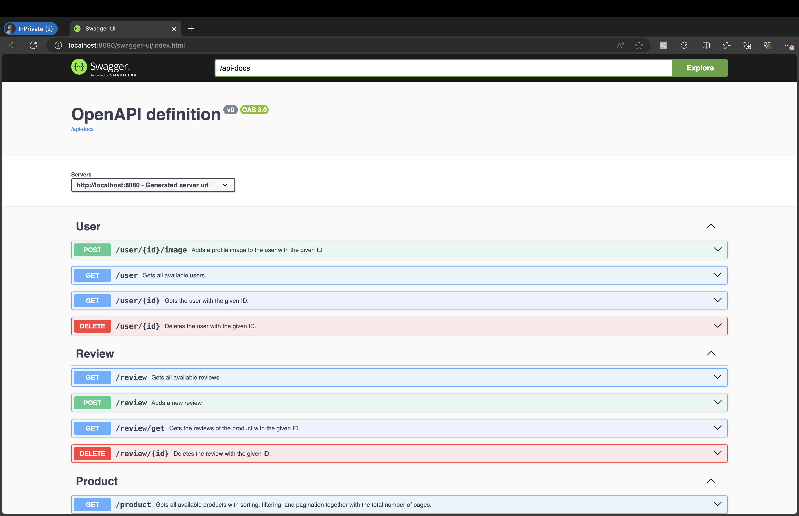<br>

## Techstack
- Backend
  - Java Spring Boot (17)
  - JPA
  - Password Encoder
  - Swagger, OpenAPI
  - MySQL (8.1)
  - Postman
  - [Azurite](https://learn.microsoft.com/en-us/azure/storage/common/storage-use-azurite?tabs=visual-studio%2Cblob-storage) &ndash; local equivalent of Azure Storage (used for images)
  - Docker &ndash; docker-compose, multi-stage images for smaller image sizes
- Frontend
  - React
  - Cookies (used for logged in user info storage)
  - Redux (state management)
  - [Saga](https://redux-saga.js.org) &ndash; Redux side effect manager (used for the business logic handling)
  - TypeScript
  - CSS
  - [RadixUI](https://www.radix-ui.com)
  - Nginx (used for serving the static files)
- CI/CD
  - Unit Tests &ndash; both for Backend and Frontend
  - Selenium (coming soon)
  - SonarQube (coming soon)
  - Terraform (coming soon)
  - Grafana (coming soon)

## Code structure
For the code structure, please refer to the submodule repository READMEs.

## Demo
### Home Page
The left bar contains different filtering and sorting options.
On the right of the searchbar, there is a category dropdown for filtering.
**Note:** filtering and sorting is done on the **backend** side for faster results.<br>
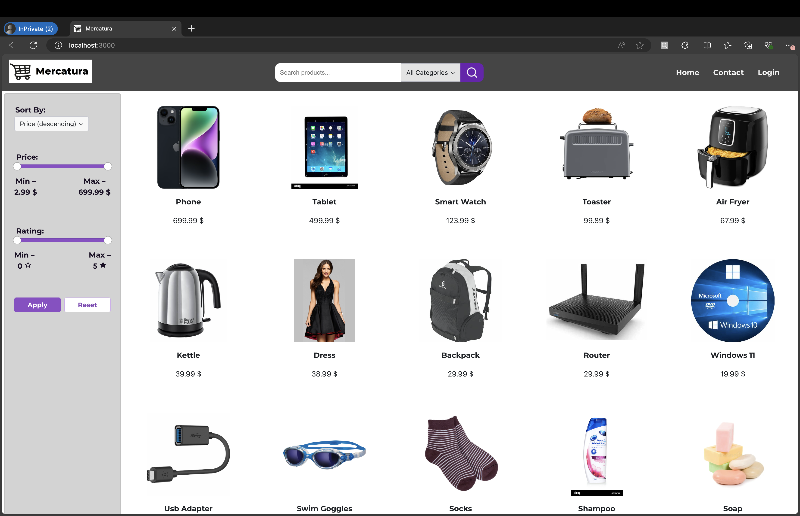<br>
By default, the frontend fetches 15 products. If there are more products pagination controls appear at the bottom of the home page.<br>
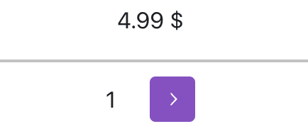

### Login Page
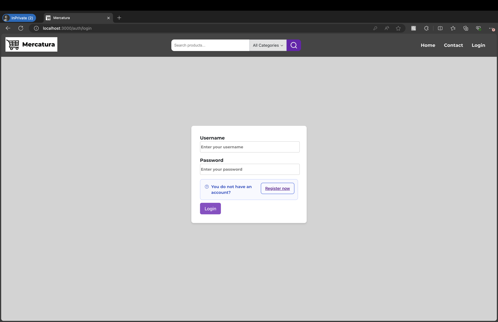<br>
**Note:** the user might have to relogin if he/she has stopped and restarted the backend container.

### Register Page
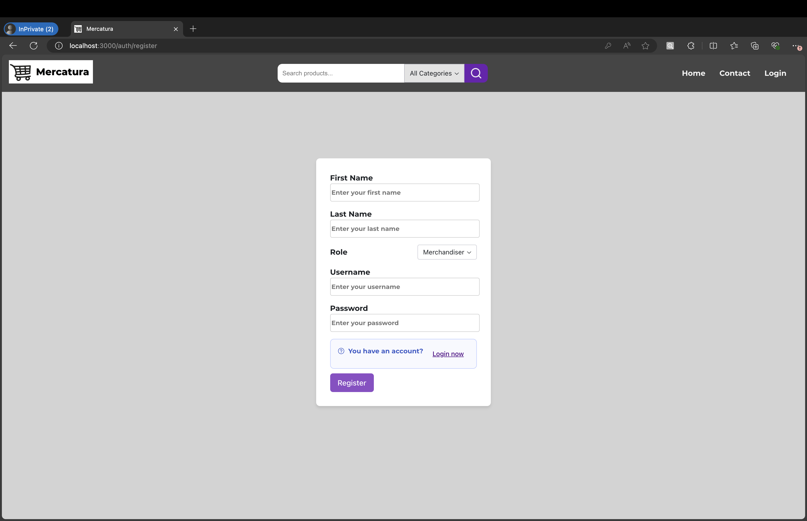<br>
**Note:** the user cannot register as an admin on FE. There is already an admin account created. <br>Credentials: <br>
username **admin** <br>
password: **password**

### Dynamic Pages
After the user logs in, based on his/her roles, he/she can see and navigate to the pages &ndash; Merchandising and Admin.<br>


### Product Details
Here the user can see several details about the product.<br>
On the right side, user always sees at most 5 products from the same category.<br>
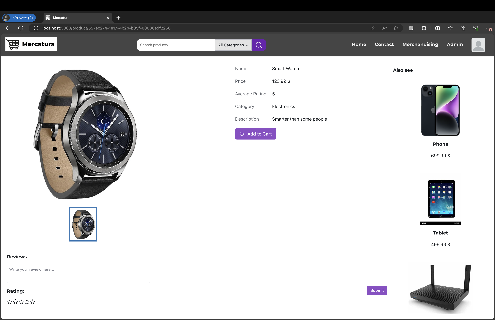<br>

#### Reviews
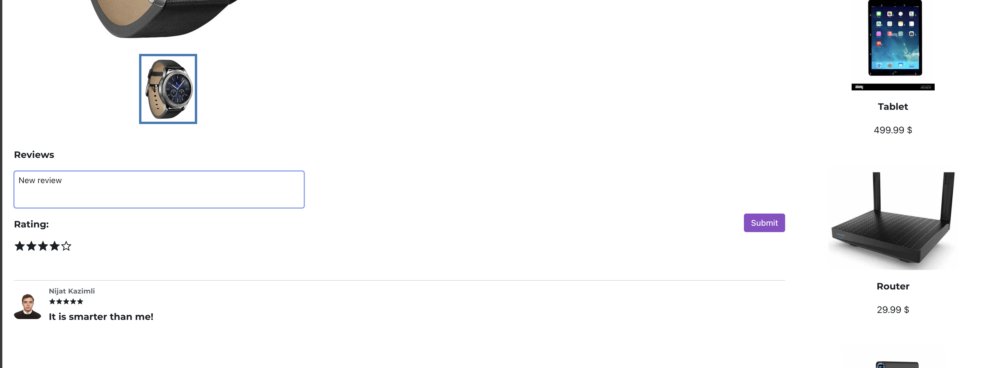<br>

#### Add to cart
If you do not have any carts, do not worry. You can create one here.<br>
If the item is already in the cart, you cannot add it again.<br>
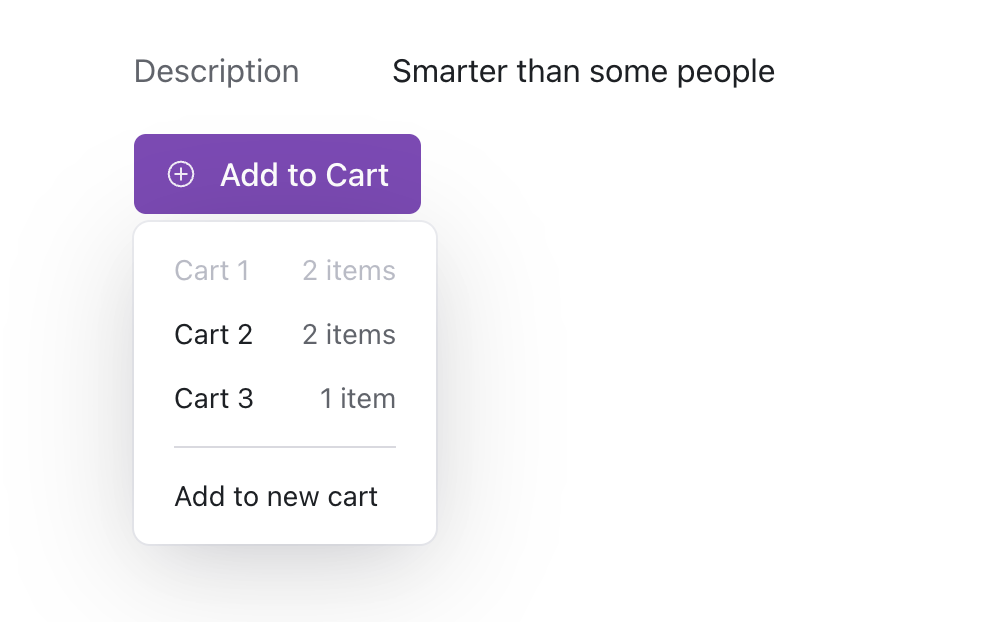<br>

### Profile Photo Context Menu
Here the user can access profile, carts pages, and logout<br>
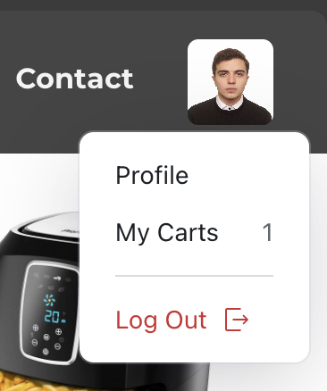<br>

### Carts
Here the user can create a new cart, see all the cart details, pay them, see items, or even delete.<br>
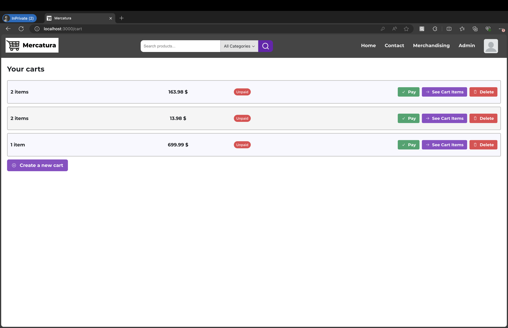<br>

#### Cart Items
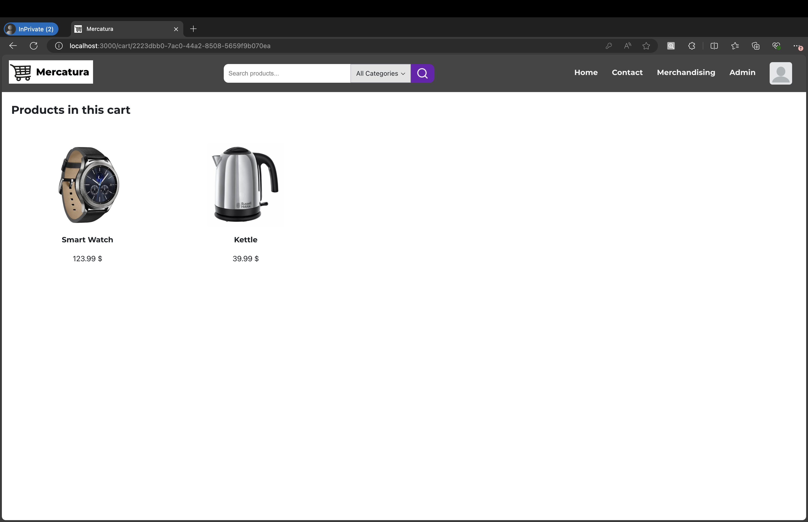<br>

### Profile Page
Here the user can change his/her profile picture or password, logout, or even delete the account.
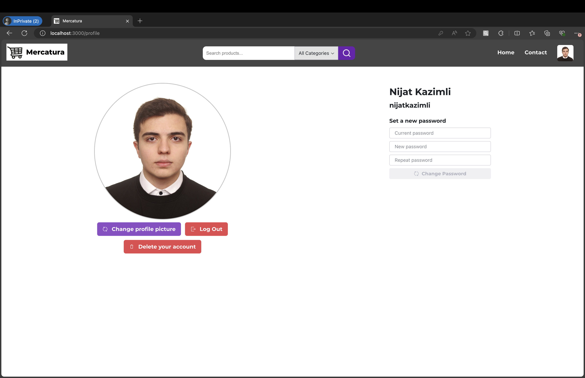<br>

### Merchandising Page
Here the merchandiser can add products, categories, photos for the products, or delete the products.<br>
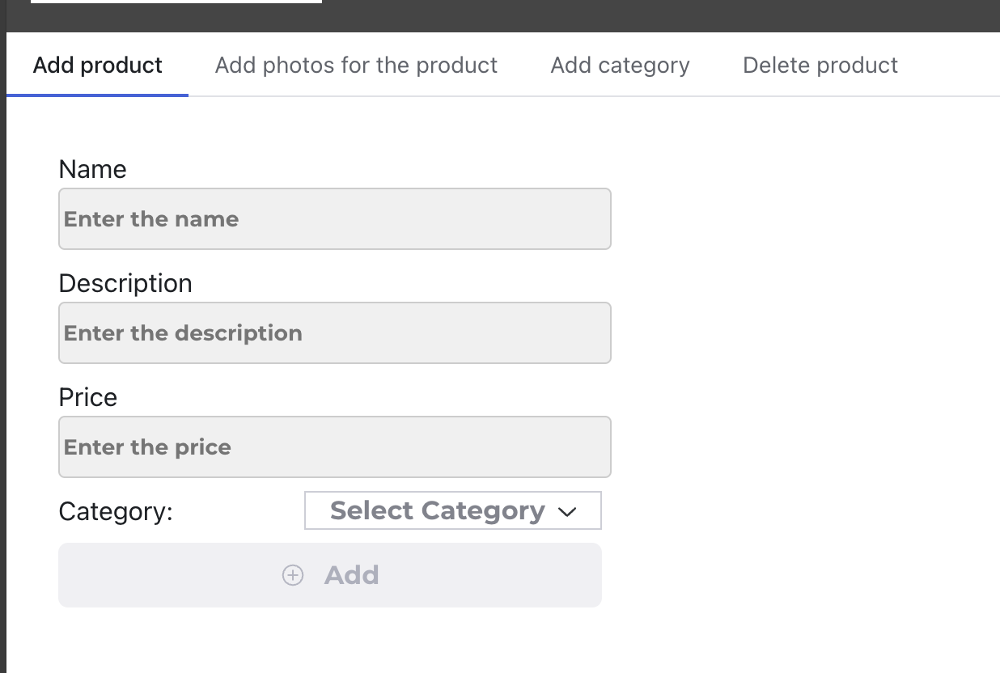<br>

### Admin Page
Here the admin can see numerous statistics about users, carts, and products in a chart or table form.<br>
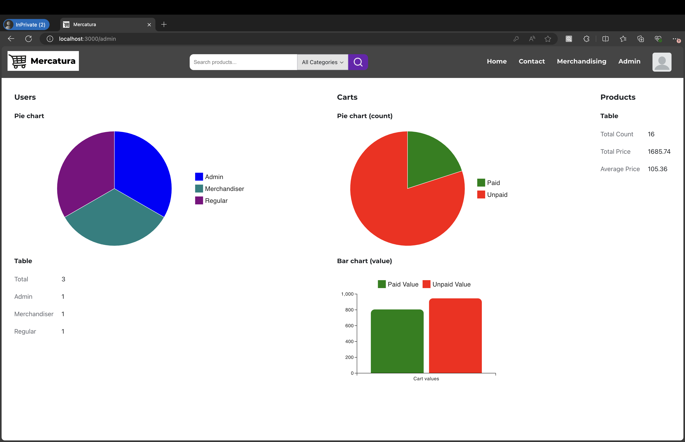<br>

### Contact Page
Here the user can see my contact details.<br>
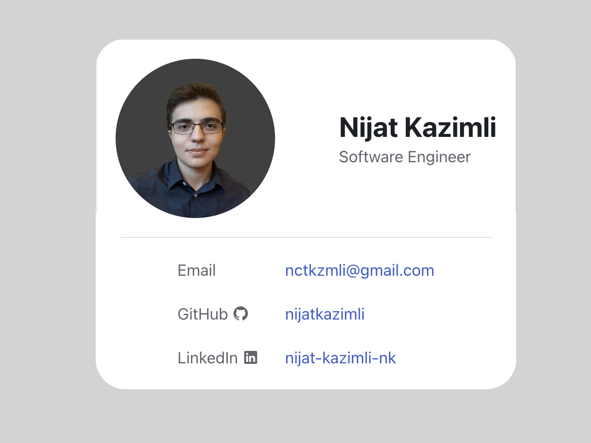<br>
